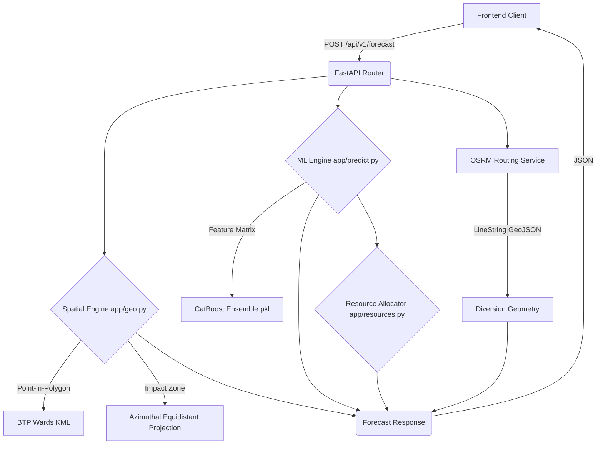

# Bengaluru Traffic Police (BTP) Predictive Command Center — Backend API


> **Enterprise-grade predictive backend for the Bengaluru Traffic Police Event-Driven Congestion System.**  
> Built for the Flipkart Grid 2.0 (Round 2) Hackathon.

---

## 📖 Executive Summary

The **BTP Predictive Command Center** API serves as the intelligent core for the [Frontend Dashboard](https://github.com/Amogh-Gurudatta/Flipkart-Gridlock-Hackathon-2-Round-2-Frontend), managing traffic-affecting events (e.g., accidents, construction, tree falls, rallies) across Bengaluru.

By synthesizing historical traffic patterns, real-time spatial data, and expert system heuristics, the API provides:

1. **Machine Learning Forecasting**: Predicts the exact duration of an event's impact on traffic flow using a specialized `CatBoost` ensemble.
2. **Dynamic Resource Allocation**: Calculates optimal personnel (Traffic Cops) and hardware (Barricades, Cranes) deployment.
3. **Automated Jurisdiction Inference**: Uses a precise Point-In-Polygon algorithm over BTP Ward KML boundaries to instantly route events to the correct responding police station.
4. **Intelligent Diversion Generation**: Interfaces with OSRM to map and visualize real road-network diversion geometries to minimize secondary congestion.

---

## 🏗 System Architecture

The service follows a decoupled, modular architecture designed for high availability and rapid inference.



### Directory Structure

```text
btp-backend/
├── app/
│   ├── __init__.py
│   ├── main.py          # FastAPI application & HTTP routing orchestration
│   ├── models.py        # Pydantic schemas for robust I/O validation
│   ├── predict.py       # ML Pipeline, model loading, & inference logic
│   ├── geo.py           # Geospatial operations, KML parsing, & OSRM integration
│   └── resources.py     # Expert system rules (manpower & hardware caps/thresholds)
├── blr_police.kml       # BTP Jurisdiction Boundaries (Spatial Data)
├── catboost_ensemble.pkl# Pre-trained ML artifact
├── requirements.txt     # Locked production dependencies
└── run.py               # Uvicorn entry point
```

---

## 🚀 Key Technical Highlights

### 1. Robust Predictive Engine

The `CatBoost` ensemble is trained on 5 fundamental columns: `event_cause`, `corridor`, `priority`, `hour_of_day`, and `day_of_week`. The system parses this model artifact directly to avoid silent schema drift in production. Outputs are mathematically transformed (`expm1`) for accurate log-duration predictions.

### 2. Precise Spatial Operations

Instead of naive coordinate bounding boxes, the system utilizes an **Azimuthal Equidistant Projection** centered strictly on the incident's GPS coordinates. This ensures that the generated impact buffers (e.g., 500m for a breakdown, 1500m for construction) are geometrically perfect circular polygons in meters, eliminating latitudinal distortion.

### 3. Smart Jurisdiction & Backup Routing

The API completely abstracts jurisdiction away from the client. By processing the live `blr_police.kml` boundary file through `GeoPandas` and `Shapely`, the API automatically calculates the responsible precinct via Point-In-Polygon checks. If the required personnel exceeds the station's active capacity, the system triggers a `needs_backup` flag autonomously.

### 4. Real-time OSRM Diversions

The service queries public OSRM routing nodes to generate a real road-network path (`GeoJSON LineString`) designed to circumnavigate the calculated spatial impact zone. It falls back gracefully to standard routing if OSRM is unreachable.

---

## 🛠 Tech Stack

- **Framework**: `FastAPI` (Python 3.10+)
- **Server**: `Uvicorn` (Asynchronous ASGI)
- **Machine Learning**: `CatBoost`, `scikit-learn`, `numpy`, `pandas`
- **Geospatial Processing**: `GeoPandas`, `Shapely`, `fiona`, `pyproj`
- **Validation**: `Pydantic` V2

---

## ⚙️ Environment Setup & Installation

### Prerequisites

- Python 3.10 or higher
- (Optional but recommended) Conda or Python `venv`

### Local Development Quickstart

1. **Clone the repository:**

   ```bash
   git clone <repository_url>
   cd btp-backend
   ```

2. **Create and activate a virtual environment:**

   ```bash
   python3 -m venv venv
   source venv/bin/activate  # On Windows: venv\Scripts\activate
   ```

3. **Install exact dependencies:**

   ```bash
   pip install -r requirements.txt
   ```

4. **Verify artifacts:**
   Ensure `catboost_ensemble.pkl` and `blr_police.kml` are present in the project root.

5. **Start the ASGI server:**
   ```bash
   python run.py
   ```

The server will launch at `http://localhost:8000`.
Interactive Swagger API documentation is automatically generated at `http://localhost:8000/docs`.

---

## 📡 API Reference

### `GET /health`

Liveness probe for orchestration platforms (Kubernetes, AWS ALB).

**Response (200 OK):**

```json
{
  "status": "ok",
  "timestamp": "2026-06-21T10:32:00.000Z"
}
```

### `POST /api/v1/forecast`

The primary inference endpoint.

**Request Body:**

```json
{
  "eventCause": "accident",
  "eventType": "unplanned",
  "priority": "High",
  "corridor": "Tumkur Road",
  "requiresRoadClosure": true,
  "policeStation": "AUTO_ASSIGNED",
  "location": {
    "lat": 13.0285,
    "lng": 77.5195,
    "address": "Near Peenya Metro Station, Tumkur Road"
  }
}
```

**Response (200 OK):**

```json
{
  "event_id": "BTP-850BD1",
  "cause": "accident",
  "location": {
    "lat": 13.0285,
    "lng": 77.5195,
    "address": "Near Peenya Metro Station, Tumkur Road"
  },
  "predictions": {
    "estimated_duration_mins": 70.9,
    "severity_level": "HIGH"
  },
  "deployment_recommendation": {
    "traffic_cops_needed": 10,
    "barricades": 24,
    "cranes": 1,
    "diversion_route": "Divert via Magadi Road",
    "diversion_geometry": {
      "type": "LineString",
      "coordinates": [[77.5195, 13.0285]]
    },
    "total_cops_required": 10,
    "total_barricades_required": 24,
    "total_cranes_required": 1,
    "needs_backup": false,
    "responding_station": "Peenya"
  },
  "spatial_impact_geojson": {
    "type": "Polygon",
    "coordinates": []
  }
}
```

---

## 🔒 Known Limitations & Roadmap

- **Isochrone Polygons**: The current impact zones are accurate distance-based circles. Future updates aim to implement full driving-distance isochrones based on network edges.
- **Traffic Feeds**: Real-time GPS congestion ingestion (via Google/TomTom APIs) is slated for v2 to create dynamic feedback loops for the CatBoost model.

---

## 👥 Contributors

- **Aatraya Mukherjee** — Geospatial Engineering & Core Backend
- **Aryan** — Predictive Engine & Machine Learning pipeline
- **Amogh Gurudatta** — Frontend & UI Integration

_Copyright © 2026. Licensed under the MIT License._
